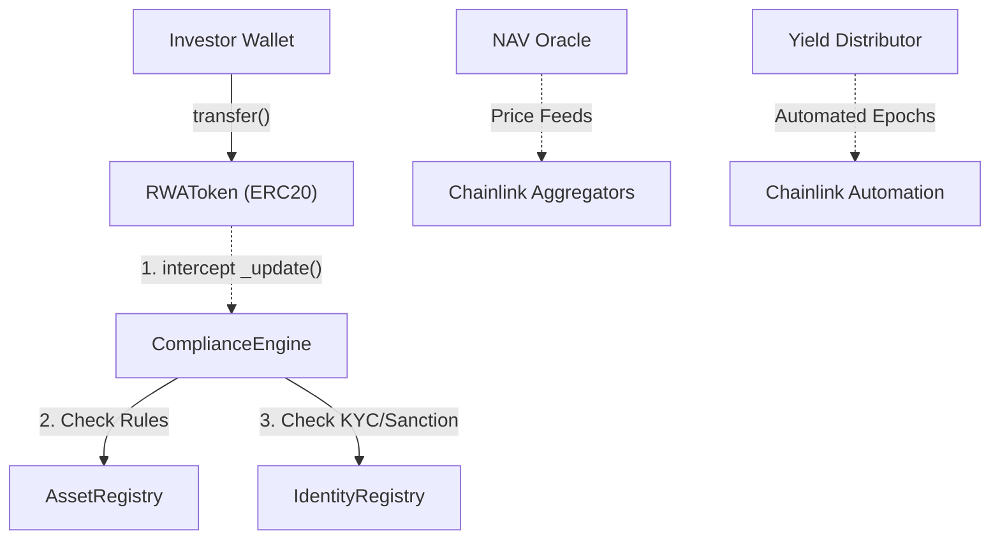

<div align="center">


# Nexus RWA Protocol
### Institutional-Grade Real-World Asset Tokenization · Base Mainnet

<br>

[](https://opensource.org/licenses/MIT)
[](https://book.getfoundry.sh/)
[](https://basescan.org/)
[](#-security--testing-model)

<br>

> **Bridging Traditional Finance (TradFi) and Decentralized Finance (DeFi) safely.**<br>
> A robust smart contract engine that embeds global compliance, identity verification (KYC),
> real-time NAV pricing, and automated yield distribution directly into the token layer.

<br>

🌐 DApp Portal (Coming Soon) &nbsp;·&nbsp;
[🔗 Core Asset Registry](https://basescan.org/address/0x88bb8025dc10Cc642d2F0D10F4335EcDBdC9A594)

</div>

---

## 📖 Overview

Standard ERC-20 tokens are permissionless, making them unsuitable for heavily regulated Real-World Assets (RWAs) like US Treasury Bills, Real Estate, or Corporate Bonds.

The **Nexus RWA Protocol** solves this by abstracting legal complexity into immutable code. Every token mint, burn, and peer-to-peer transfer is intercepted and validated against an on-chain compliance engine. It ensures that tokens can only be held by verified, non-sanctioned investors who meet specific jurisdictional and accreditation rules. Coupled with Chainlink-automated Merkle yield drops and circuit-breaking NAV oracles, it provides a complete ecosystem for tokenized securities.

---

## 🎯 Why This Matters

| Traditional/Basic Tokenization | Nexus RWA Protocol |
| :--- | :--- |
| **Manual Compliance** (Off-chain checks, easily bypassed) | **Embedded Rulebook** (Transfers revert instantly if KYC/Sanction rules fail) |
| **No Legal Recourse** (Lost/stolen keys mean lost assets) | **Legal Clawbacks** (Authorized `forcedTransfer` for court-ordered recovery) |
| **Gas-Heavy Payouts** (Looping through holders to pay yield) | **O(1) Gas Merkle Claims** (Chainlink Automation + Off-chain Merkle trees) |
| **Oracle Manipulation** (Flash crash vulnerabilities) | **15% Circuit Breaker** (Automatic pause on >15% NAV drop in 24 hours) |

---

## 🏛️ Protocol Architecture

The protocol separates concerns into distinct, hyper-optimized smart contracts. Identity is decoupled from the asset, and compliance logic is isolated from the token itself.



### 1. `IdentityRegistry.sol` (ERC-3643 Inspired)

The identity hub. Stores cryptographic commitments to off-chain PII (Personally Identifiable Information). Tracks verification tiers (Basic, KYC, Accredited), physical country codes, and strictly enforces global OFAC sanction checks.

### 2. `AssetRegistry.sol` (The Asset Ledger)

Manages the lifecycle of multiple RWAs. Defines supply caps, maturity dates, and asset-specific jurisdictional rules (e.g., "Asset A can only be traded by Accredited US investors").

### 3. `ComplianceEngine.sol` (The Gatekeeper)

The central rulebook. It hooks into the `RWAToken` to evaluate every transfer in real-time. It manages global investor blacklisting, protocol-wide asset freezing, and executes authorized legal clawbacks.

### 4. `NAVOracle.sol` (The Price Feed)

Integrates with Chainlink Data Feeds to provide real-time Net Asset Value (NAV). Includes a strict staleness guard and an autonomous **15% circuit breaker** that halts reads if a 24-hour flash crash is detected.

### 5. `YieldDistributor.sol` (The Payout Engine)

A hyper-efficient, pull-based yield distributor. Uses off-chain Merkle Trees to allocate yield (USDC) to thousands of investors without blowing block gas limits. Cycles are seamlessly advanced via Chainlink Automation.

---

## 🛡️ The Nexus Difference: Security by Design

Most traditional RWA protocols rely heavily on centralized multisigs, delayed off-chain API approvals for transfers, and bloated monolithic contracts. **Nexus RWA** introduces a radically different, mathematically verified approach:

* **Stateless Real-Time Compliance:** The `ComplianceEngine` evaluates complex jurisdictional and sanction rules entirely on-chain in `O(1)` time. No off-chain API delays, no centralized approvals required for peer-to-peer secondary trading.
* **Strictly Decoupled Architecture:** Funds (Yield), ledgers (Assets), and rules (Compliance) are heavily siloed. A logic bug in yield distribution can never compromise the compliance registry or the asset ledger.
* **Mathematical Certainty:** Instead of relying solely on basic unit testing, the protocol's core constraints (e.g., *Total Supply <= Supply Cap*, *Blocked Investors = Zero Balance*) are mathematically proven against millions of chaotic, randomized state transitions using **Stateful Invariant Fuzzing**.
* **Zero-Trust Legal Recovery:** Court-ordered asset recoveries (`forcedTransfer`) do not require dangerous proxy upgrades. They are natively built-in, role-gated, and emit immutable cryptographic proofs on-chain.

---

## 🔒 Security & Testing Model

* **Mathematically Proven Security:** 100% test coverage across 219+ unit/integration tests and stateful invariant fuzzing (5,000+ random sequence calls) verifying non-whitelisted balance, cap breach, and yield double-claim invariants.
* **Audit & Static Analysis:** Built with strict CEI patterns and verified via Slither (v0.10) with 0 Critical / 0 High vulnerabilities. Complete findings and design trade-offs are documented in security-report.md

---

## ✅ Deployed Contracts (Base Mainnet)

The core protocol is live, verified via Sourcify, and operational on **Base Mainnet** (Chain ID: `8453`).

| Component | Contract Address |
| --- | --- |
| **Identity Registry** | [`0x18026c0BF58c978caDc8Df7f31b1cbC2f6A94c5A`](https://basescan.org/address/0x18026c0BF58c978caDc8Df7f31b1cbC2f6A94c5A) |
| **Asset Registry** | [`0x88bb8025dc10Cc642d2F0D10F4335EcDBdC9A594`](https://basescan.org/address/0x88bb8025dc10Cc642d2F0D10F4335EcDBdC9A594) |
| **Compliance Engine** | [`0x00c0E82e0C81c4Df096aAd98f2aA5A399b34131c`](https://basescan.org/address/0x00c0E82e0C81c4Df096aAd98f2aA5A399b34131c) |
| **NAV Oracle** | [`0xE4BeA2a081BA5d7137618840aFD012883014cbdD`](https://basescan.org/address/0xE4BeA2a081BA5d7137618840aFD012883014cbdD) |
| **Genesis Token (nUSTB)** | [`0xFDFda5Ca91bDC022EC85C9F2bE5d29A33f874EDE`](https://basescan.org/address/0xFDFda5Ca91bDC022EC85C9F2bE5d29A33f874EDE) |
| **Yield Distributor** | [`0x8cbdAC28819d95b8425a0BdFD37610075F021996`](https://basescan.org/address/0x8cbdAC28819d95b8425a0BdFD37610075F021996) |

---

## 🛠️ Local Setup & Testing

Built entirely using the [Foundry](https://book.getfoundry.sh/) toolchain.

```bash
# Clone the repository
git clone https://github.com/NexTechArchitects/Nexus-RWA-Protocol.git
cd Nexus-RWA-Protocol

# Install dependencies
forge install

# Compile contracts
forge build

# Execute the 219+ test suite
forge test -vvv

# Run stateful invariant fuzzing
forge test --match-path test/invariant/InvariantProtocol.t.sol
```

---

<div align="center">

#### Architected & Engineered by [NexTech Architects](https://github.com/NexTechArchitects)

#### Smart Contract Security · RWA Tokenization · Foundry · Full Stack Web3

</div>